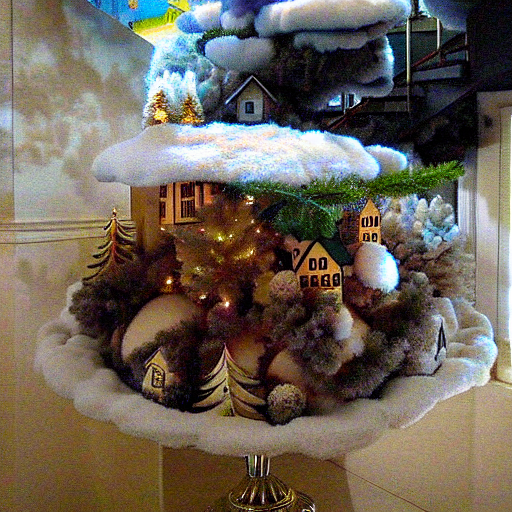

# Regularization by Texts for Latent Diffusion Inverse Solvers


### This is the official repository for "Regularization by Text for Latent Diffusion Inverse Solvers" (ICLR2025 spotlight)

Jeongsol Kim*, Geon Yeong Park*, Hyungjin Chung, and Jong Chul Ye

Korea Advanced Institute of Science and Technology (KAIST)

(* Equal contribution)


## Abstract

Current diffusion-based inverse problem solvers depend on the prior distribution in reducing the solution space. However, it always provide the most likely solution, which is not always the desired solution. 

Thus, we explore an __additional cue in solving inverse problem__ and propose a novel framework called __Regularization by Texts (TReg)__.

By defining a latent optimization problem and solvig it in alternative approach, TReg successfully find a __solution that satisfies both 1) data consistency and 2) text-guidance.__


## Quick Start

### Environment steup
Clone this repository and create a virtual environment.

```
git clone https://github.com/TReg-inverse/TReg.git
cd TReg

conda create -n treg python==3.11
conda activate treg
pip install -r requirements.txt
```

### Example: Use true class as prompt

TReg is an inverse problem solver that uses text description of solution to refine the solution space.

For severe degradations, this can improve the accuracy of obtained solution compared to the case without text.

```
python solve.py \
    --task_config configs/task/super-resolution.yaml \
    --null_prompt "out of focus, depth of field" \
    --prompt "a photo of a cat" \
    --img_path "samples/cat_1.jpg" \
    --cfg_guidance 5.0 \
    --null_lr 1e-3 \
    --use_AN;
```

Expected results : 

Measurement | Solution (w/o text) | Solution (w/ text)
:---------:|:---------:|:----------:
 |  | 


```
python solve.py \
    --task_config configs/task/gauss-deblur.yaml \
    --null_prompt "out of focus, depth of field" \
    --prompt "a photo of a dog" \
    --img_path "samples/dog_1.jpg" \
    --cfg_guidance 5.0 \
    --null_lr 5e-4 \
    --use_AN;
```

Expected results : 

Measurement | Solution (w/o text) | Solution (w/ text)
:---------:|:---------:|:----------:
 |  | 


> For solutions w/o text, we just set `--cfg_guidance` to zero.

### Example: Use different class as prompt

Using TReg, we can find a solution of inverse problem according to text prompt.

Here, the proper solution should satisfy both 1) data consistency and 2) alignment with prompt.


#### Case 1. Super-resolution (x16, Bicubic)
```
python solve.py \
    --task_config configs/task/super-resolution.yaml \
    --null_prompt "out of focus, depth of field" \
    --prompt "christmas tree" \
    --img_path "samples/icecream_1.jpg" \
    --null_lr 1e-3 \
    --cfg_guidance 5.0 \
    --use_AN;
```

Expected results : 

Measurement | Reconstruction | A(Solution) 
:---------:|:---------:|:---------:
 |  | 

#### Case 2. Gauss-deblur
```
python solve.py \
    --task_config configs/task/gauss-deblur.yaml \
    --null_prompt "out of focus, depth of field" \
    --prompt "spaghetti" \
    --img_path "samples/friedrice_1.jpg" \
    --null_lr 1e-3 \
    --cfg_guidance 5.0 \
    --use_AN;
```

Expected results : 

Measurement | Reconstruction | A(Solution)
:---------:|:---------:|:--------:
 |  | 


> Note that obtained solution satisfies both 1) data consistency (right column) and 2) text aligment (middle column).


### More solutions

You can try to obtain various solution by giving different text prompts.

Please refer to the below examples. Note that we set `--null_lr` to `8e-4`.

If the solution includes artifacts, you can either
- reduce `--null_lr`
- turn on `--use_DPS`

_"penne pasta"_ | _"tacos"_ | _"shrimp"_
:------:|:-------:|:-------:
 |  | 


## Citation

```
@inproceedings{
    kim2025regularization,
    title={Regularization by Texts for Latent Diffusion Inverse Solvers},
    author={Jeongsol Kim and Geon Yeong Park and Hyungjin Chung and Jong Chul Ye},
    booktitle={The Thirteenth International Conference on Learning Representations},
    year={2025},
    url={https://openreview.net/forum?id=TtUh0TOlGX}
}
```
